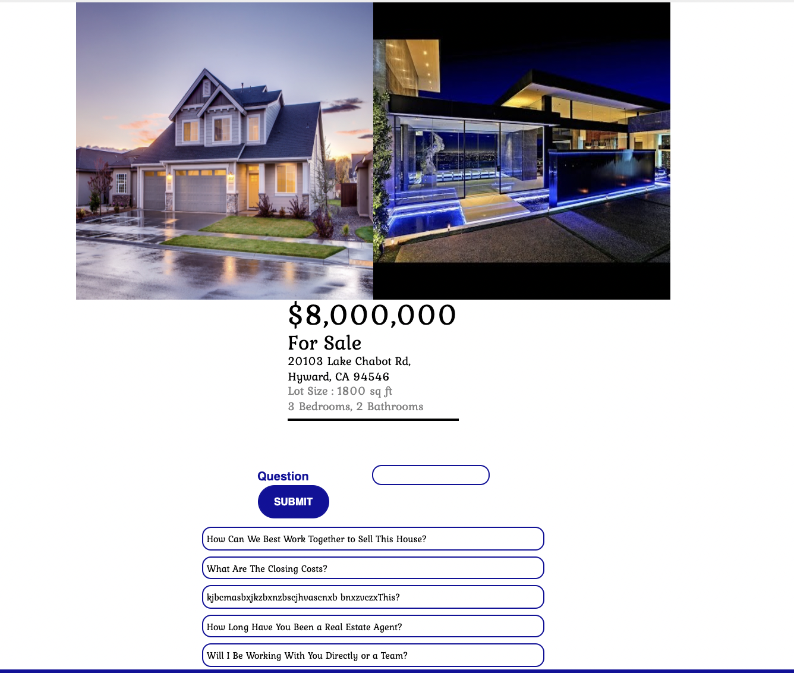

<p align='center'>
  
</p>

# got a home?
got a home? is a short description of the app. It is a fullstack React App made with a Redux state manager and a backend using Python, Flask, SQL-Alchemy, and PostgresSQL and any other technologies. 

* View the <a href='https://gotahome.herokuapp.com/'>gotahome</a> App Live

* Reference to the gotahome <a href='https://github.com/Jomix-13/Got-a-Home/wiki'>Wiki Docs</a>

| Table of Contents |
| ----------------- |
| 1. [Features](#features) |
| 2. [Installation](#installation) |
| 3. [Technical Implementation Details](#technical-implementation-details) |
| 4. [Future Features](#future-features) |
| 5. [Contact](#contact) |
| 6. [Special Thanks](#special-thanks) |


## Technologies
* <a href="https://developer.mozilla.org/en-US/docs/Web/JavaScript"></a>
* <a href="https://www.postgresql.org/"></a>
* <a href="https://nodejs.org/"></a>
* <a href="https://reactjs.org/"></a>
* <a href="https://redux.js.org/"></a>
* <a href="https://developer.mozilla.org/en-US/docs/Web/CSS"></a>
* <a href="https://www.python.org/"></a>
* <a href="https://flask.palletsprojects.com/"></a>
* <a href="https://www.heroku.com/home"></a>


## Features

### Sign In and Sign Up
<!--  -->


### Feed Page
<div>gotahome feed displays all Homes</div>
<div>Discover and search for new Homes</div>


### View Home
<div>Single Home of name, photos, Questions</div>



### Add Home
<div>Add new Home to the database</div>

<div>Edit Existing Home</div>


### Create, Read, Update, Delete Home Questions
<div>View Questions


<div>Edit and Add Questions in the database</div>


## Installation
To build/run project locally, please follow these steps:

1. Clone this repository

```shell
git clone https://github.com/{github-handle}/gotahome.git
```

2. Install Pipfile dependencies and create the virtual environment
```shell
pipenv install
```

2. Install npm dependencies for the `/react-app`

```shell
cd react-app
npm install
```

3. In the `/` root directory, create a `.env` based on the `.env.example` with proper settings

4. Setup your PostgreSQL user, password and database and ensure it matches your `.env` file

5. Before running any flask commands, confirm you are in the pipenv virtual env. If not, run the command:
```shell
pipenv shell
```

5. In the root folder, create the database by running in the terminal:
```shell
flask db create
```

6. In the root folder, migrate tables to the database by running in the terminal:
```shell
flask db migrate
```

7. In the root folder, seed the database by running in the terminal:
```shell
flask seed all
```

8. Start the flask backend in the `/` root directory
```shell
flask run
```

9. Start the frontend in the `/react-app` directory

```javascript
npm start
```


<!-- ## Technical Implementation Details

### {Detail 1}
Description 1

Part of code is shown below:

```python
print('add code snippet 1 here')
```

Description 2

```javascript
print('add code snippet 2 here')
```

## Future Features

1. __Search__ - search Homes

2. __Add Multiable Images__ - Add more than one photo for home
 -->

## Contact

### John Wanis
<a href="https://www.linkedin.com/in/john-wanis-764957138/"></a>
<a href="https://github.com/Jomix-13/"></a>

John.Wanis@yahoo.com


## Special Thanks
* Fellow peers who have given me support and community: [Andrew](https://github.com/andru17urdna), [Lema](https://github.com/lemlooma), [Meagan](https://github.com/meagan13),[Nico](https://github.com/nicopierson), [Owen](https://github.com/owiwamasa) and [Monte](https://github.com/theflaggship)
* Mentors who have given me their time and effort: [Caleb](https://github.com/CalebAmes)

